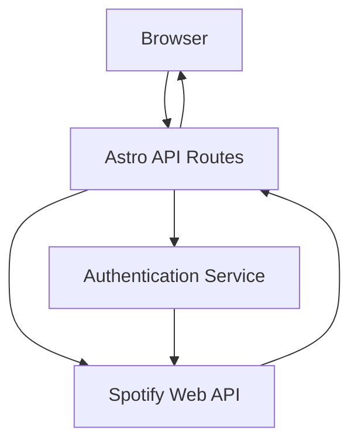

# Design Document

## Overview

The Spotify API integration will be implemented as Astro API routes that interact with the Spotify Web API. The solution will use server-side rendering to fetch data and provide JSON endpoints for displaying music information and controlling playback. The integration will use OAuth 2.0 with the Authorization Code flow for authentication.

## Architecture

The integration follows a simple server-side architecture:



### Key Components:
- **API Routes**: Astro API endpoints handling HTTP requests
- **Spotify Service**: Service layer for Spotify Web API interactions
- **Authentication Handler**: OAuth 2.0 flow management
- **Response Formatter**: JSON response standardization

## Components and Interfaces

### 1. API Routes Structure
```
src/pages/api/spotify/
├── index.ts          # GET /api/spotify - Main endpoint
├── play.ts           # POST /api/spotify/play - Start playback
├── stop.ts           # POST /api/spotify/stop - Stop playback
└── auth/
    ├── login.ts      # GET /api/spotify/auth/login - OAuth login
    └── callback.ts   # GET /api/spotify/auth/callback - OAuth callback
```

### 2. Spotify Service Interface
```typescript
interface SpotifyService {
  getTopTracks(timeRange?: 'short_term' | 'medium_term' | 'long_term'): Promise<Track[]>
  getCurrentlyPlaying(): Promise<CurrentlyPlayingResponse | null>
  getFollowedArtists(): Promise<Artist[]>
  pausePlayback(): Promise<void>
  startPlayback(contextUri?: string, uris?: string[], deviceId?: string): Promise<void>
}
```

### 3. Data Models (Based on Latest Spotify Web API)
```typescript
interface Track {
  id: string
  name: string
  artists: Array<{
    id: string
    name: string
    external_urls: {
      spotify: string
    }
  }>
  album: {
    id: string
    name: string
    images: Array<{
      url: string
      height: number
      width: number
    }>
  }
  uri: string
  external_urls: {
    spotify: string
  }
  duration_ms: number
  popularity: number
}

interface CurrentlyPlayingResponse {
  item: Track | null
  is_playing: boolean
  progress_ms: number | null
  currently_playing_type: 'track' | 'episode' | 'ad' | 'unknown'
  device: {
    id: string
    is_active: boolean
    name: string
    type: string
    volume_percent: number
  }
}

interface Artist {
  id: string
  name: string
  followers: {
    total: number
  }
  genres: string[]
  images: Array<{
    url: string
    height: number
    width: number
  }>
  external_urls: {
    spotify: string
  }
  popularity: number
}
```

## Data Models

### API Response Format
All endpoints will return standardized JSON responses:

```typescript
interface ApiResponse<T> {
  success: boolean
  data?: T
  error?: string
  timestamp: string
}
```

### Main Endpoint Response
```typescript
interface SpotifyData {
  topTracks: Track[]
  currentlyPlaying: CurrentlyPlayingResponse | null
  followedArtists: Artist[]
}
```

## Error Handling

### Error Categories:
1. **Authentication Errors**: Invalid or expired tokens
2. **API Rate Limiting**: Spotify API rate limit exceeded
3. **Network Errors**: Connection issues with Spotify API
4. **Validation Errors**: Invalid request parameters

### Error Response Format:
```typescript
interface ErrorResponse {
  success: false
  error: string
  code: string
  timestamp: string
}
```

### Error Handling Strategy:
- Graceful degradation for non-critical failures
- Automatic token refresh for expired authentication
- Retry logic for transient network errors
- Clear error messages for client debugging

## Testing Strategy

### Unit Tests:
- Spotify service methods
- Data transformation functions
- Error handling logic
- Authentication flow components

### Integration Tests:
- API endpoint responses
- Spotify Web API integration
- OAuth flow end-to-end
- Error scenarios

### Environment Setup:
- Mock Spotify API responses for testing
- Test environment variables
- Automated testing in CI/CD pipeline

## Authentication Flow

### OAuth 2.0 Implementation:
1. User visits `/api/spotify/auth/login`
2. Redirect to Spotify authorization URL
3. User grants permissions
4. Spotify redirects to `/api/spotify/auth/callback`
5. Exchange authorization code for access token
6. Store tokens securely (environment variables or secure storage)

### Token Management:
- Access tokens expire after 1 hour
- Refresh tokens for automatic renewal
- Secure storage of sensitive credentials
- Environment variable configuration

## Configuration Requirements

### Environment Variables:
```
SPOTIFY_CLIENT_ID=your_client_id
SPOTIFY_CLIENT_SECRET=your_client_secret
SPOTIFY_REDIRECT_URI=https://yourdomain.com/api/spotify/auth/callback
SPOTIFY_ACCESS_TOKEN=your_access_token
SPOTIFY_REFRESH_TOKEN=your_refresh_token
```

### Spotify App Settings:
- Redirect URI must match production domain
- Required scopes: 
  - `user-read-playback-state` - Read currently playing track
  - `user-modify-playback-state` - Control playback (play/pause)
  - `user-top-read` - Read top tracks and artists
  - `user-follow-read` - Read followed artists
- API Endpoints Used:
  - `GET /v1/me/top/tracks` - Get user's top tracks
  - `GET /v1/me/player/currently-playing` - Get currently playing track
  - `GET /v1/me/following?type=artist` - Get followed artists
  - `PUT /v1/me/player/pause` - Pause playback
  - `PUT /v1/me/player/play` - Start/resume playback

## Deployment Considerations

### Astro Configuration:
- Enable Node.js adapter for server-side API routes
- Configure environment variables in deployment platform
- Ensure HTTPS for OAuth callback URLs

### Security:
- Never expose client secret in client-side code
- Use secure HTTP-only cookies for session management
- Validate all incoming requests
- Implement rate limiting for API endpoints